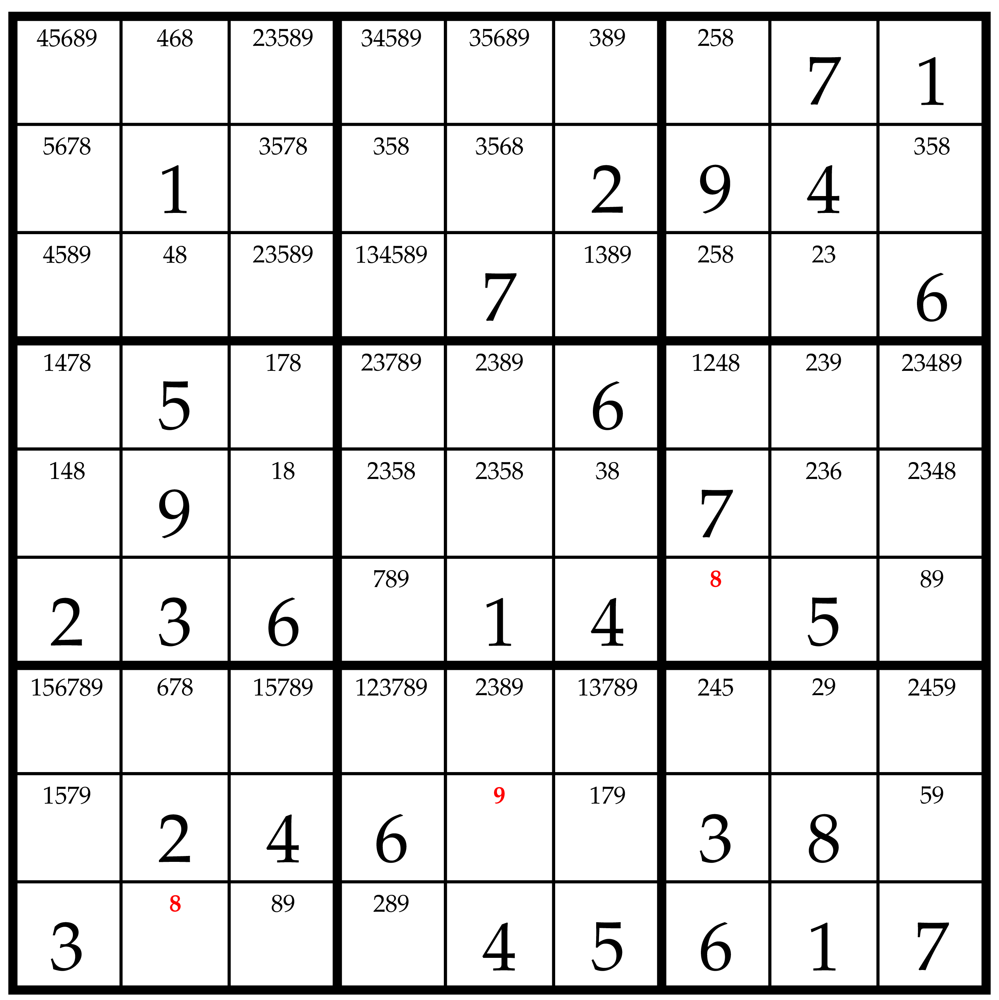
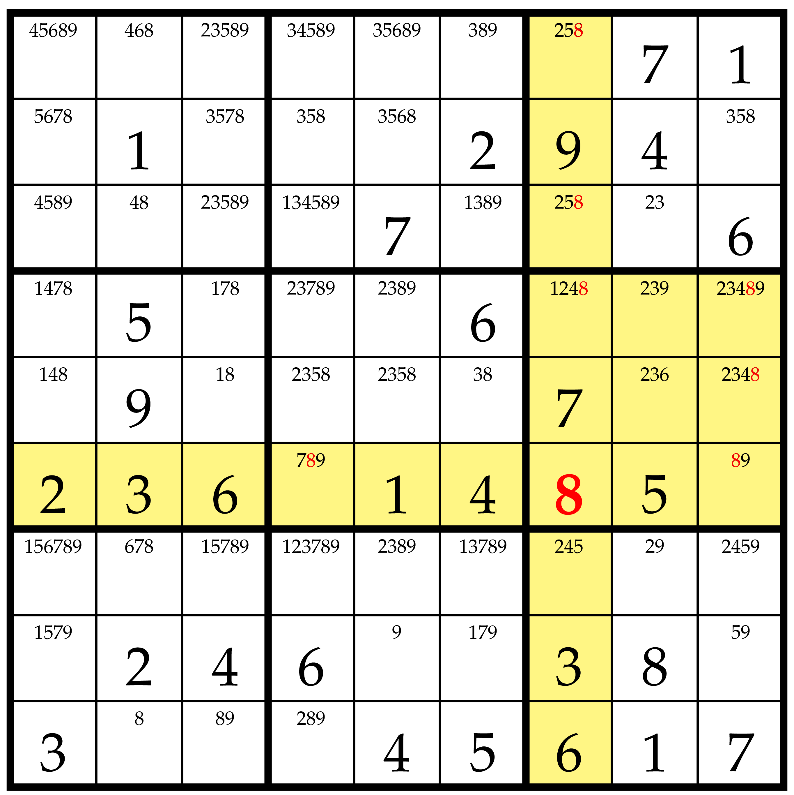
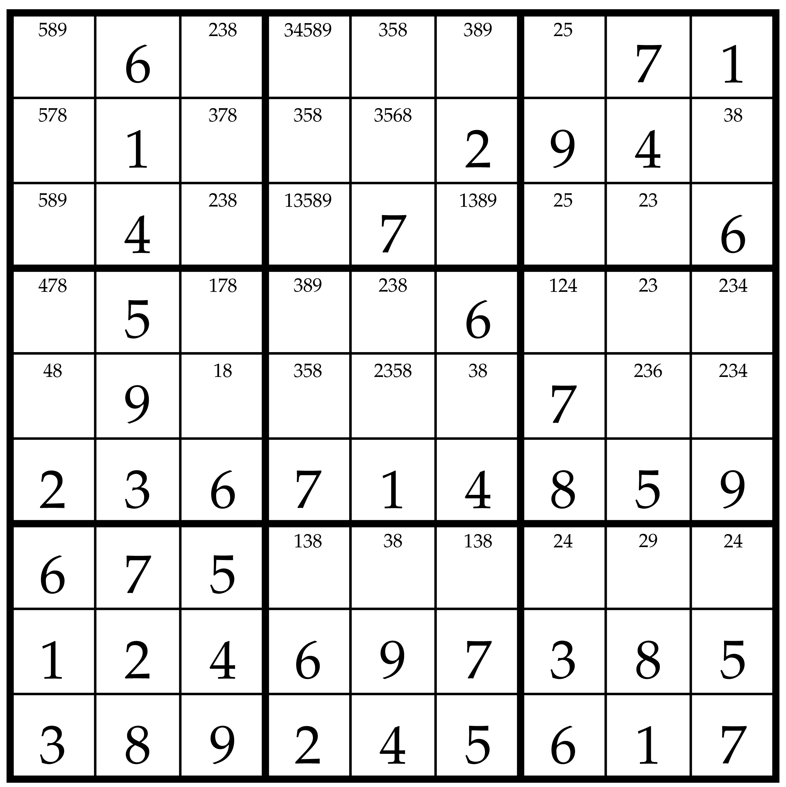
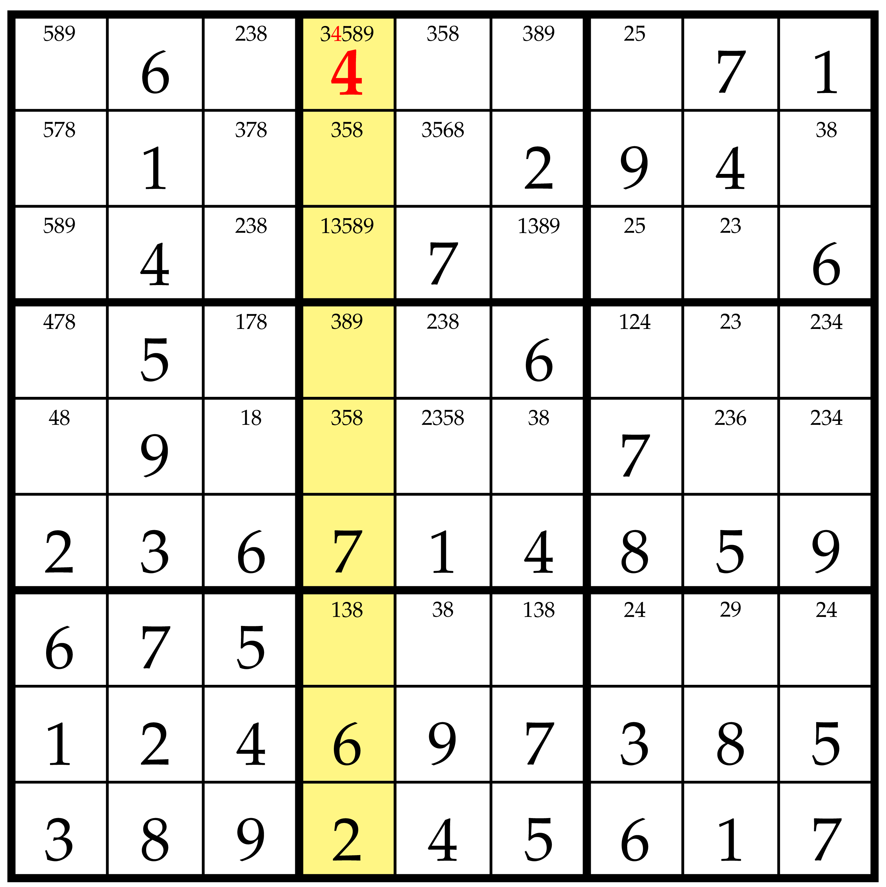
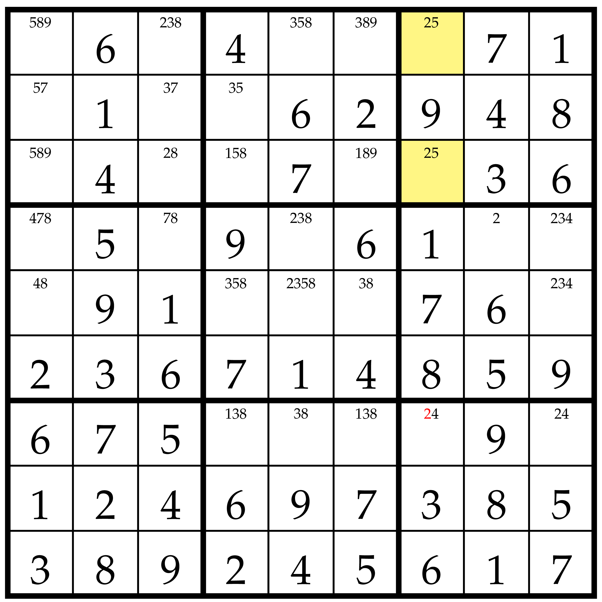
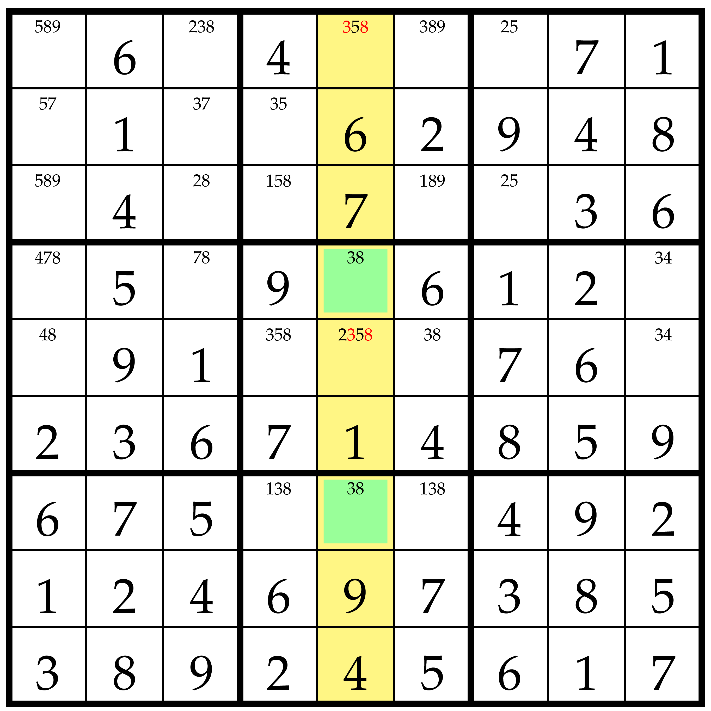

# Sudoku

## Crookův algoritmus

Zadání sudoku s dopsanými čísly, které jdou dosadit

## Dosazení jediného možného čísla
Najdeme políčka, do kterých jde dosadit jen jediné číslo

Dosadíme a v políčkách ve stejném řádku, sloupci nebo boxu zakážeme dosazené číslo

Tímto postupem se ale dostaneme jen sem

## Doplnění čísla do jediného políčka možného políčka

Pokud je v nějakém řádku, sloupci nebo boxu dosadit číslo, které se v něm ještě nenachází, jen do jednoho políčka, dosadíme ho tam.

tímto postupen se dostaneme jen sem

## outside box

Pokud se některé číslo v jednom boxu objevuje jen v jednom řádku nebo sloupci, nemůže se v tomto řádku nebo sloupci objevovat mimo tento box. Proto ho vyřadíme.

Na tato políčka by šel použít i Crookův algoritmus, protože obě obsahují pouze dvě stejná čísla. Kdyby v jednom z těchto políček bylo i jiné číslo, které by v druhém nebylo, stále by šel tento postup použít, ale Crookův algoritmus už ne.

## Crook
Crookův algoritmus funguje na úvaze, že když se v *n* políčách v řádku, sloupci nebo boxu opakuje právě *n* stejných čísel, nemůžou se tato čísla obejvovat jinde. Kdyby totiž bylo jinde, nemohlo by být v zmíněné *n*-tici, takže by jedno políčko zůstalo na ocet.

V obrázku jsou vymazány zároveň 3 i 8, tento program by je však odstranil po jednom. 

